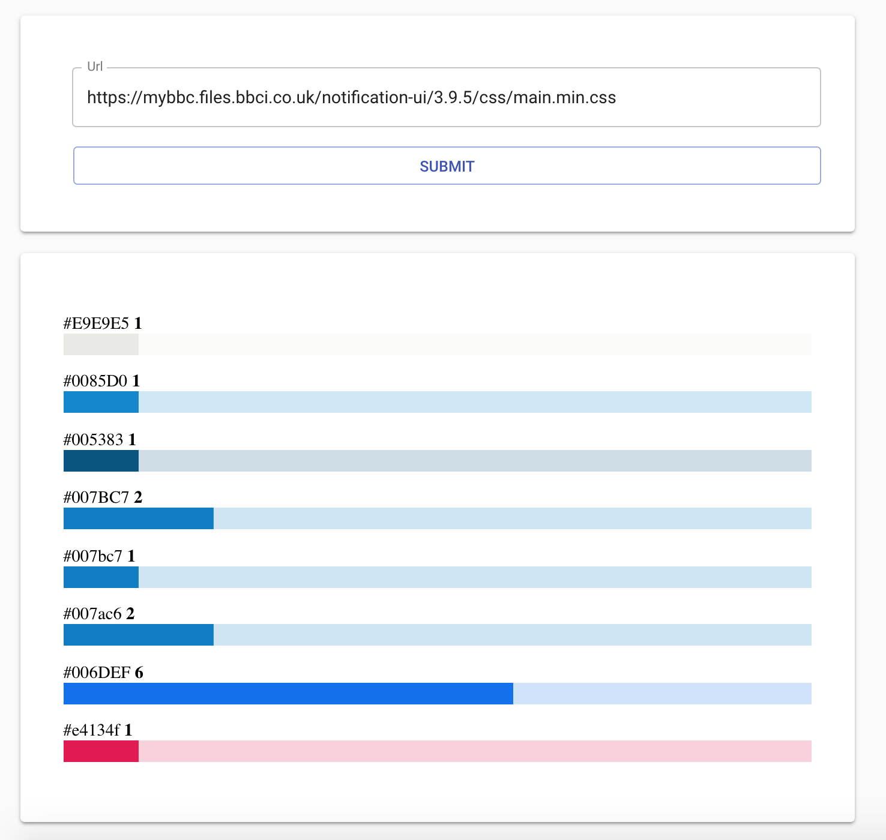

# Site color map

This little tool will return all colors in the css style sheet provided in the URL and the number of occurrences.



## Usage

```
npm install
npm start
```

## License

Copyright (c) 2018 [Hao Chang](https://github.com/haochang)

Licensed under [the MIT License](./LICENSE).
